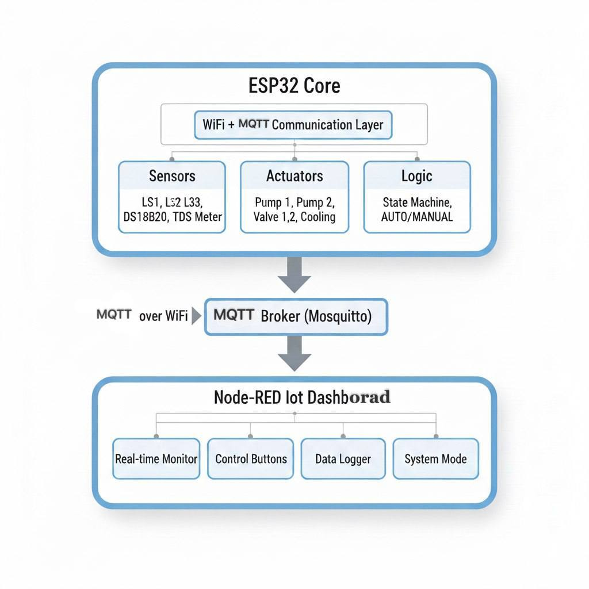
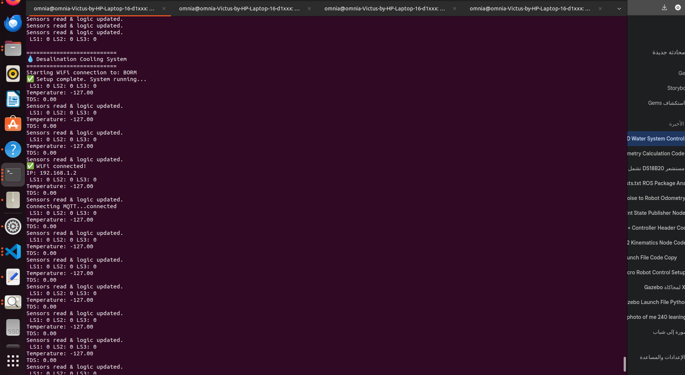
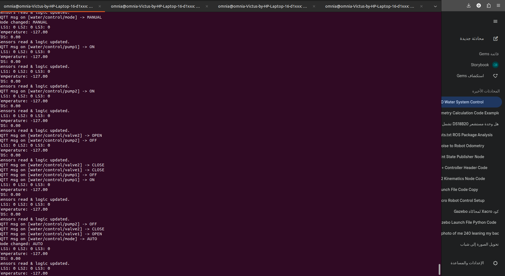
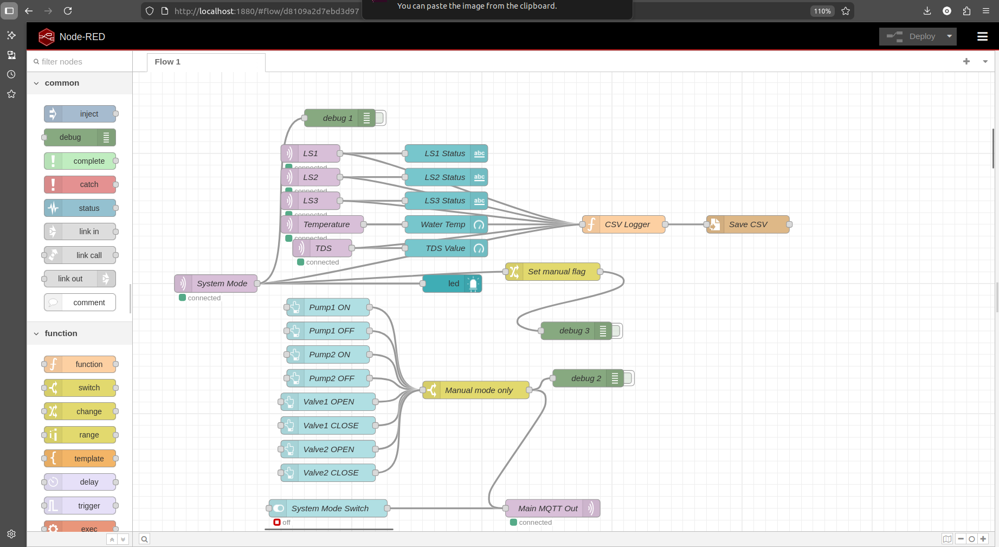
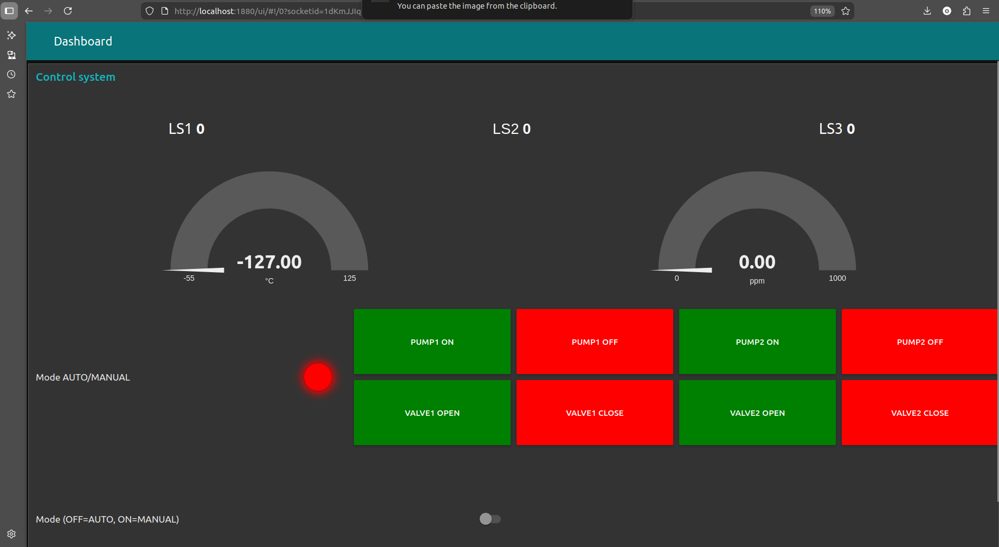
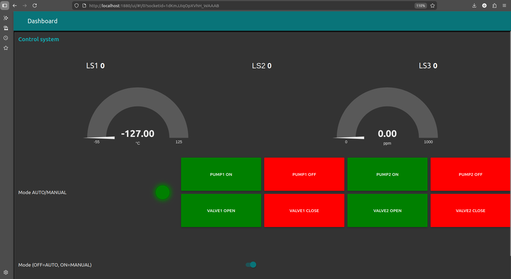

# IoT-Enabled Automated Freeze Desalination and Cooling System

## 📋 Table of Contents
- [Overview](#overview)
- [Scientific Background](#scientific-background)
- [System Architecture](#system-architecture)
- [Features](#features)
- [Hardware Components](#hardware-components)
- [Software Stack](#software-stack)
- [Installation](#installation)
- [System Operation](#system-operation)
- [Data Visualization](#data-visualization)
- [Research Foundation](#research-foundation)
- [Performance Metrics](#performance-metrics)
- [Future Enhancements](#future-enhancements)
- [Contributing](#contributing)
- [License](#license)
- [References](#references)

---

## 🌊 Overview

This project implements an **IoT-enabled automated freeze desalination system** that combines advanced water purification technology with real-time monitoring and control capabilities. The system leverages the freeze crystallization principle to produce fresh water from saline sources while simultaneously providing cooling energy—addressing two critical global challenges: water scarcity and energy-efficient cooling.

### Key Highlights
- **Energy Efficient**: Freeze desalination requires only ~1/7th of the energy compared to thermal evaporation methods
- **Dual Functionality**: Produces potable water AND provides cooling capacity for climate control or refrigeration
- **IoT-Enabled**: Real-time monitoring via MQTT protocol with Node-RED dashboard
- **Automated Control**: State-machine-based operation with manual override capability
- **Low Cost**: Built on ESP32 microcontroller with readily available sensors

---

## 🔬 Scientific Background

### Freeze Desalination Technology

Freeze desalination (FD) is an emerging sustainable water purification method that exploits the physical principle that when saline water freezes, pure water crystallizes first, leaving salt and impurities in the remaining brine. This process occurs because:

1. **Lower Energy Requirement**: The latent heat of fusion for ice (~334 kJ/kg) is approximately **7 times lower** than the latent heat of vaporization for water (~2,260 kJ/kg), making freeze desalination significantly more energy-efficient than distillation-based methods.

2. **Natural Separation**: During crystallization at sub-zero temperatures, water molecules form pure ice crystals while dissolved salts are rejected to the liquid phase due to their lower freezing points.

3. **Reduced Corrosion**: Operating at sub-zero temperatures minimizes corrosion and scaling issues common in thermal desalination systems.

4. **Scalability**: The modular nature allows systems to scale from household to industrial applications.

### Process Advantages

According to recent research:
- Freeze-melting desalination operates with significantly lower energy consumption than the 3–6 kWh/m³ required by reverse osmosis (RO)
- Progressive freezing desalination produces larger ice crystals which help reduce brine attachment, thereby improving the desalination effect with lower energy consumption
- The FD process needs approximately 1/7th of the latent heat required by vaporization-based desalination processes, and the involvement of sub-zero temperature reduces the risk of corrosion and scaling

---

## 🏗️ System Architecture

### Hardware Architecture

This diagram illustrates the hardware and software components of the IoT system.



### Software Stack
```
Application Layer:    Node-RED Dashboard + CSV Logger
Communication Layer:  MQTT Protocol (PubSubClient)
Hardware Layer:       ESP32 + Sensors + Actuators
Physical Layer:       Freeze Desalination Process
```

---

## ✨ Features

### Real-Time Monitoring
- **Level Sensors (LS1, LS2, LS3)**: Monitor water levels across multiple stages
- **Temperature Sensor (DS18B20)**: Precise monitoring of freezing temperature (-2°C to 5°C range)
- **TDS Sensor**: Measure Total Dissolved Solids to verify water quality (WHO standard: <400 μS/cm)
- **Data Logging**: Automatic CSV export with timestamps for analysis

### Automated Control
- **5-Stage State Machine**:
  1. **Stage 1**: Initial water filling detection
  2. **Stage 2**: Primary pump activation when water detected
  3. **Stage 3**: Transfer to cooling chamber
  4. **Stage 4**: Freeze crystallization process (target: ≤-2°C)
  5. **Stage 5**: Ice harvesting and cycle restart
  
- **Intelligent Valve Control**: Auto-closing timers (Valve1: 5s, Valve2: 3s)
- **Safety Interlocks**: Prevents simultaneous conflicting operations

### Dual Operation Modes
- **AUTO Mode**: Fully automated operation following the state machine logic
- **MANUAL Mode**: Remote manual control of all actuators via MQTT/Dashboard

### IoT Connectivity
- **MQTT Protocol**: Lightweight publish-subscribe messaging
- **WiFi Integration**: Remote monitoring from anywhere
- **Node-RED Dashboard**: Professional web-based interface
- **Mobile Compatible**: Access dashboard from smartphones/tablets

---

## 🛠️ Hardware Components

| Component | Model/Type | GPIO Pin | Purpose |
|-----------|-----------|----------|---------|
| **Microcontroller** | ESP32 DevKit | - | Main controller with WiFi |
| **Level Sensor 1** | Float Switch | GPIO 12 | Detect initial water level |
| **Level Sensor 2** | Float Switch | GPIO 13 | Confirm filling complete |
| **Level Sensor 3** | Float Switch | GPIO 15 | Monitor cooling chamber |
| **Temperature Sensor** | DS18B20 (Waterproof) | GPIO 4 | Measure water temperature |
| **TDS Sensor** | TDS Meter v1.0 | GPIO 34 (ADC) | Measure water quality |
| **Pump 1** | 12V DC Pump | GPIO 25 | Primary water intake |
| **Pump 2** | 12V DC Pump | GPIO 26 | Transfer to cooling |
| **Valve 1** | Solenoid Valve | GPIO 27 | Ice release mechanism |
| **Valve 2** | Solenoid Valve | GPIO 32 | Brine drainage |
| **Cooling System** | Peltier/Compressor | GPIO 33 | Freeze crystallization |
| **Relay Module** | 8-Channel 5V | - | Actuator control |
| **Power Supply** | 12V 5A | - | System power |

#### Prototyping Tip: Use LEDs to simulate high-power devices before connecting pumps or valves.

### Additional Components
- 4.7kΩ resistor (DS18B20 pullup) or use modules 
- Jumper wires and breadboard/PCB
- Enclosure (waterproof recommended)

---

## 💻 Software Stack

### Embedded Software (ESP32)
- **Platform**: Arduino IDE / PlatformIO
- **Core Libraries**:
  - `WiFi.h` - ESP32 WiFi connectivity
  - `PubSubClient.h` - MQTT client implementation
  - `OneWire.h` + `DallasTemperature.h` - DS18B20 interface
  
### Communication Protocol
- **MQTT Topics**:
  ```
  water/LS1, water/LS2, water/LS3        → Level sensor states
  water/temperature                      → Temperature readings (°C)
  water/tds                              → TDS values (ppm)
  water/pump1/status, water/pump2/status → Pump states
  water/valve1/status, water/valve2/status → Valve states
  water/cooling/status                   → Cooling system state
  water/system/mode                      → AUTO/MANUAL mode
  water/control/#                        → Control commands
  ```

### Dashboard (Node-RED)
- **UI Elements**:
  - Real-time gauges (temperature, TDS)
  - Status indicators (level sensors, mode)
  - Control buttons (pumps, valves)
  - Data logger (CSV export)
  
- **Required Nodes**:
  - `node-red-dashboard`
  - MQTT broker integration
  - File writer for logging

---

## 🚀 Installation

### 1. Hardware Setup
1. Connect all sensors and actuators according to GPIO pin mapping
2. Ensure proper power supply (12V for pumps/valves, 3.3V for sensors)
3. Install 4.7kΩ pullup resistor between DS18B20 data pin and VCC
4. Verify no GPIO conflicts (especially GPIO 14 → use GPIO 15 and 32)

### 2. ESP32 Firmware
```bash
# Clone the repository
git clone https://github.com/Omniasherief/freeze-desalination-iot.git
cd freeze-desalination-iot

# Configure WiFi and MQTT
# Edit: src/communication/wifi_manager.h
#   - Set WIFI_SSID and WIFI_PASS
# Edit: src/communication/mqtt_handler.h
#   - Set MQTT_BROKER IP address

# Upload to ESP32
arduino-cli compile --fqbn esp32:esp32:esp32 main.ino
arduino-cli upload -p /dev/ttyUSB0 --fqbn esp32:esp32:esp32 main.ino
# or upload and mintor on terminal 
pio run -t upload && pio device monitor 
```

### 3. MQTT Broker Installation
```bash
# Ubuntu/Debian
sudo apt-get install mosquitto mosquitto-clients

# macOS
brew install mosquitto
brew services start mosquitto

# Windows
# Download from https://mosquitto.org/download/
```

### 4. Node-RED Setup
```bash
# Install Node.js (if not installed)
curl -fsSL https://deb.nodesource.com/setup_18.x | sudo -E bash -
sudo apt-get install -y nodejs

# Install Node-RED
sudo npm install -g --unsafe-perm node-red

# Install dashboard
cd ~/.node-red
npm install node-red-dashboard

# Start Node-RED
node-red

# Import flow
# Navigate to http://localhost:1880
# Menu → Import → Paste nodered_flow.json
# Configure MQTT broker IP
# Deploy
```

### 5. Access Dashboard
Open browser: `http://localhost:1880/ui`

---

## ⚙️ System Operation

### AUTO Mode Operation

The system follows a 5-stage state machine:

**Stage 1: Initial State**
- System monitors LS2 for water detection
- When LS2 = LOW (no water), activate Pump1
- Transition to Stage 2

**Stage 2: Filling Primary Tank**
- Pump1 fills until LS1 AND LS2 = HIGH
- Deactivate Pump1, activate Pump2
- Transition to Stage 3

**Stage 3: Cooling Chamber Transfer**
- Pump2 transfers water to cooling chamber
- When LS3 = HIGH, deactivate Pump2
- Activate cooling system
- Transition to Stage 4

**Stage 4: Freeze Crystallization**
- Cooling system maintains temperature ≤-2°C
- Ice crystals form, rejecting salt to brine
- When temperature reaches ≤-2°C, deactivate cooling
- Open Valve1 for 5 seconds (ice release)
- Transition to Stage 5

**Stage 5: Ice Harvesting**
- Monitor temperature rise to 3-5°C (ice melted)
- Open Valve2 for 3 seconds (brine drainage)
- Reactivate Pump1
- Return to Stage 1 for next cycle

### MANUAL Mode Operation
- Override actuators via Node-RED or MQTT commands.
- Real-time monitoring continues during manual operation.

Send MQTT commands or use dashboard buttons:
```bash
# Switch to MANUAL mode
mosquitto_pub -h BROKER_IP -t "water/control/mode" -m "MANUAL"

# Control actuators
mosquitto_pub -h BROKER_IP -t "water/control/pump1" -m "ON"
mosquitto_pub -h BROKER_IP -t "water/control/valve1" -m "OPEN"
```
### Output on Terminal







---

## 📊 Data Visualization

### Dashboard Metrics
- **Temperature Gauge**: Range 0-100°C, critical zone: -5°C to 5°C
- **TDS Gauge**: Range 0-2000 ppm, WHO limit: 400 ppm indicator
- **Level Indicators**: Binary state display (0/1) for LS1, LS2, LS3
- **Mode LED**: Green (AUTO) / Red (MANUAL)

- 
#### Overall Dashboard Flow 


#### Automatic Mode

#### Manual Mode

### Data Logging
All sensor data and system events are logged to CSV:
```csv
Timestamp,Topic,Value
2025-10-30T10:15:30.123Z,water/temperature,-2.5
2025-10-30T10:15:30.456Z,water/tds,350.2
2025-10-30T10:15:30.789Z,water/LS3,1
```

---

## 📚 Research Foundation

This project is grounded in current scientific literature on freeze desalination and IoT water monitoring systems:

### Freeze Desalination Research

1. **Energy Efficiency**: Recent research from MDPI (November 2024) demonstrates that progressive freezing desalination produces larger ice crystals which reduce brine attachment, improving desalination effectiveness with lower energy consumption compared to traditional methods

2. **Dual Functionality**: A 2025 study in MDPI Water journal showed that solar-powered freeze-melting desalination systems achieve evaporator temperatures below -3°C, producing up to 8 kg/day of ice while operating with significantly lower energy consumption than reverse osmosis, and provide dual functionality for both water production and cooling applications

3. **Salinity Reduction**: Research published in ACS ES&T Water demonstrated uniform salinity levels measuring 0.34 ± 0.04 wt% NaCl for 1.7 wt% NaCl solution using directional top-cooling solidification techniques, with energy analysis indicating a 5% reduction in consumption compared to conventional methods

4. **Process Modeling**: High-fidelity CFD modeling studies (June 2024) showed that freeze desalination achieves purification efficiency ranging from 20% to above 40% across various temperatures and salt concentrations, with machine learning identifying principal experimental parameters influencing desalination efficiency

### IoT Water Monitoring Systems

5. **ESP32 Implementation**: Research on ESP32-based IoT systems (June 2024) demonstrated high stability and fast response times for real-time water monitoring, with applications in smart homes, industrial automation, and Industry 4.0 integration using MQTT protocol

6. **Water Quality Monitoring**: IoT water quality monitoring studies using ESP32 with pH, turbidity, and temperature sensors achieved classification accuracy of more than 95% on average, demonstrating reliability for distributed monitoring systems

7. **Level Control Systems**: Industrial-grade water level control implementations using ESP32 with ultrasonic sensors and MQTT demonstrated intelligent automation with state-machine approaches, hysteresis-based control logic, and real-time dashboard visualization

### Key Citations
- Sustainability Journal: "Sustainable Desalination with Freezing Crystallization" (Nov 2024)
- MDPI Water: "Solar-Powered Freeze-Melting Desalination" (Jan 2025)
- ACS ES&T Water: "Directional Top-Cooling Solidification" (2024)
- Nature npj Clean Water: "Advances in Freeze Desalination" (April 2022)
- Various IEEE Conferences on IoT water monitoring (2023-2025)

---

## 📈 Performance Metrics

### Expected System Performance

| Metric | Target | Notes |
|--------|--------|-------|
| **Ice Production Rate** | 5-10 kg/day | Based on cooling capacity |
| **Energy Consumption** | <2 kWh/m³ | Significantly lower than RO (3-6 kWh/m³) |
| **TDS Reduction** | 85-95% | From 35,000 ppm (seawater) to <500 ppm |
| **Freezing Temperature** | -2°C to -5°C | Optimal ice crystal formation |
| **Cycle Duration** | 2-4 hours | Per batch, depending on volume |
| **System Uptime** | >95% | With automated monitoring |
| **Response Time** | <2 seconds | MQTT message delivery |
| **Data Update Rate** | 1 Hz | Sensor readings every 1 second |

### Water Quality Standards
- **WHO Potable Water**: TDS < 400 ppm
- **Irrigation Water**: TDS < 2000 ppm
- **System Output**: Typically 200-500 ppm (suitable for irrigation and livestock)

---

## 🔮 Future Enhancements

### Short-term Improvements
- [ ] Machine learning for predictive maintenance
- [ ] Energy consumption monitoring
- [ ] Multi-stage desalination for higher purity

### Long-term Research Directions
- [ ] Solar power integration for off-grid operation
- [ ] LNG cold energy utilization (for coastal installations)
- [ ] Ultrasonic enhancement for improved ice crystallization
- [ ] Integration with smart grid for load balancing
- [ ] Scaling to industrial capacity (100+ L/day)
- [ ] Hybrid FD-RO system for maximum efficiency

### Advanced Features
- [ ] AI-optimized control algorithms
- [ ] Blockchain-based water quality certification
- [ ] Integration with smart city infrastructure
- [ ] Carbon footprint tracking and reporting
- [ ] Remote firmware updates (OTA)

---

## 🤝 Contributing

Contributions are welcome! 

### Areas for Contribution
- Hardware optimization and PCB design
- Additional sensor integration
- Dashboard UI/UX improvements
- Documentation and tutorials
- Performance benchmarking
- Multi-language support

---

## 📄 License

This project is licensed under the MIT License - see the [LICENSE](LICENSE) file for details.

### Third-Party Licenses
- ESP32 Arduino Core: Apache 2.0
- PubSubClient: MIT
- Node-RED: Apache 2.0
- DallasTemperature: LGPL

---

## 📖 References

### Scientific Publications

1. MDPI Sustainability. (2024). "An Overview of Sustainable Desalination with Freezing Crystallization: Current Development, Future Challenges, and Prospects." *Sustainability*, 16(22), 10138.

2. MDPI Water. (2025). "Solar-Powered Freeze-Melting Desalination Model for Water and Simultaneous Cooling Applications." *Water*, 17(1), 107.

3. ACS Publications. (2024). "A Novel Method for Maintaining Low and Constant Salinity in Ice during Desalination of Binary Mixtures Using Directional Top-Cooling Solidification." *ACS ES&T Water*.

4. ScienceDirect. (2024). "Droplet freeze desalination high fidelity modeling for sustainable water purification and diverse applications." *Desalination*.

5. ScienceDirect. (2023). "Freeze desalination: Current research development and future prospects." *Water Research*, 229.

6. Nature. (2022). "A review of advances in freeze desalination and future prospects." *npj Clean Water*, 5(1).

7. Chinese Academy of Sciences. (2023). "Integrated System Developed for Ice Storage Cooling and Seawater Desalination." *Energy*.

### IoT and Embedded Systems

8. ResearchGate. (2024). "Real-Time Data Acquisition with ESP32 for IoT Applications Using Open-Source MQTT Brokers." *Proceedings in Manufacturing Systems*, 19(2).

9. ResearchGate. (2025). "Secure IoT-Based Real-Time Water Level Monitoring System Using ESP32 for Critical Infrastructure." *Journal of Cyber Security and Risk Auditing*, 2025(2).

10. Atlantis Press. (2021). "ESP32 Based Implementation of Water Quality and Quantity Regulating System." *Advances in Engineering Research*.

11. IJRASET. (2025). "IoT Based Drinking Water Quality Monitoring with ESP32." *International Journal for Research in Applied Science & Engineering Technology*.

### Technical Resources
- [ESP32 Technical Reference](https://www.espressif.com/sites/default/files/documentation/esp32_technical_reference_manual_en.pdf)
- [MQTT Protocol Specification](https://mqtt.org/mqtt-specification/)
- [Node-RED Documentation](https://nodered.org/docs/)
- [WHO Water Quality Guidelines](https://www.who.int/publications/i/item/9789241549950)

---

## 👥 Authors & Acknowledgments

**Project Developer**: [omnia Sherief]  
**Institution**: [Manoura university]  
**Contact**: [omniasheriefahmed@gmail.com]

### Acknowledgments
- ESP32 community for excellent documentation
- Node-RED community for dashboard support
- Research community for open-access publications on freeze desalination
- All contributors to open-source libraries used in this project

### Citations
If you use this project in your research, please cite:
```bibtex
@misc{freeze_desalination_iot_2025,
  author = {omnia_sherief},
  title = {IoT-Enabled Automated Freeze Desalination and Cooling System},
  year = {2025},
  publisher = {GitHub},
  url = {https://github.com/Omniasherief/freeze-desalination-iot}
}
```

---

## 📞 Support

For questions, issues, or suggestions:
- **GitHub Issues**: [Create an issue](https://github.com/Omniasherief/freeze-desalination-iot/issues)
- **Email**: omniasheriefahmed@gmail.com


---

**Made with 💧 for sustainable water solutions**

